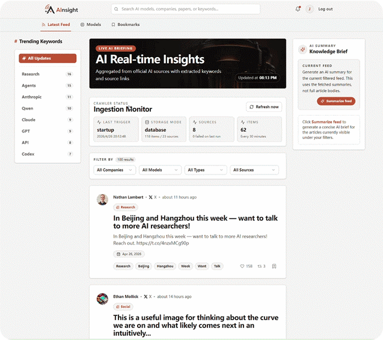

# AInsight

AInsight is a full-stack AI intelligence aggregation platform for tracking high-signal updates from major AI labs, official product blogs, research pages, and selected X accounts.

It combines a React frontend, an Express API, a PostgreSQL database via Prisma, and ingestion scripts that normalize multi-source AI news into a unified feed with keywords, source metadata, model tags, bookmarks, and admin-only AI actions.

## Demo



## What It Does

- Aggregates AI updates from official blogs, newsroom pages, release notes, and selected X accounts.
- Normalizes source data into a shared news schema with title, summary, keywords, source, model family, content type, author, and social metrics.
- Exposes a filterable feed for companies, model families, content types, sources, and search.
- Supports account-based login, bookmarks, and admin-only actions.
- Includes admin-only actions for refresh, AI feed summarization, and AI-assisted model directory updates.

## Key Features

- Real-time-style AI feed UI with source attribution and outbound links.
- Trending keyword panel generated from ingested content.
- Model directory with logos and official documentation links.
- Bookmark flow with login-gated access.
- AI summary panel for current feed selection.

## Tech Stack

### Frontend

- React
- TypeScript
- Vite
- React Router
- Tailwind CSS
- Radix UI

### Backend

- Node.js
- Express
- TypeScript
- Prisma
- PostgreSQL

### Data / Integrations

- RSS / Atom / HTML source ingestion
- `twitterapi.io` for selected X accounts
- OpenAI Responses API for AI summaries and model refresh workflows

### AI API Usage

- OpenAI Responses API
- Structured prompt-to-JSON workflows for feed summarization
- AI-assisted model directory refresh pipeline

## Monorepo Structure

```text
AInsight/
├─ .gitignore
├─ README.md
├─ package.json
├─ package-lock.json
├─ apps/
│  ├─ api/
│  │  ├─ prisma/
│  │  │  ├─ migrations/
│  │  │  └─ schema.prisma
│  │  ├─ .env.example
│  │  ├─ package.json
│  │  ├─ tsconfig.json
│  │  └─ src/
│  │     ├─ config/         # AI and X source definitions
│  │     ├─ lib/            # feed parsing, db helpers, text processing
│  │     ├─ middleware/     # auth / admin middleware
│  │     ├─ routes/         # REST API routes
│  │     ├─ scripts/        # crawler and export scripts
│  │     ├─ services/       # crawler, auth, summary, repository logic
│  │     └─ types/
│  └─ web/
│     ├─ package.json
│     ├─ public/
│     │  ├─ images/
│     │  └─ logos/
│     └─ src/
│        ├─ app/
│        │  ├─ auth/
│        │  ├─ components/
│        │  ├─ data/
│        │  ├─ layouts/
│        │  ├─ pages/
│        │  └─ types/
│        └─ styles/
└─ guidelines/              # project notes / local references
```

## Main Pages

- `Latest Feed`: filterable AI news feed with source attribution, social metrics, and bookmarking.
- `Models`: curated directory of major AI models with logos and official links.
- `Bookmarks`: saved posts for the signed-in user.
- `Login / Register`: account-based auth flow backed by the Express API.

## Local Development

Install dependencies from the repository root:

```powershell
npm install
```

Run the frontend:

```powershell
npm run dev:web
```

Run the backend:

```powershell
npm run dev:api
```

Build the frontend:

```powershell
npm run build:web
```

Build the backend:

```powershell
npm run build:api
```

## API Overview

Current backend route groups:

- `/api/auth`
- `/api/bookmarks`
- `/api/keywords`
- `/api/models`
- `/api/news`
- `/api/summary`
- `/api/system`

## Deployment Notes

Suitable when you want live crawling, database-backed bookmarks, and admin AI actions:

- Frontend: Vite build hosted on S3 / Vercel
- Backend: Node.js API hosted on EC2 / Render / Railway
- Database: PostgreSQL via RDS / Supabase / Railway

## Project Goals

- Surface AI updates from reliable sources rather than noisy generic news scraping.
- Keep source attribution explicit.
- Make AI updates searchable and filterable by practical product dimensions.

## Future Improvements

- Add pagination and feed archival strategy for older items.
- Add per-source health dashboards and ingestion analytics.
- Improve entity extraction and keyword ranking.
- Add richer article summaries based on full article bodies when needed.

## License

This repository is for portfolio and learning use unless otherwise specified.
